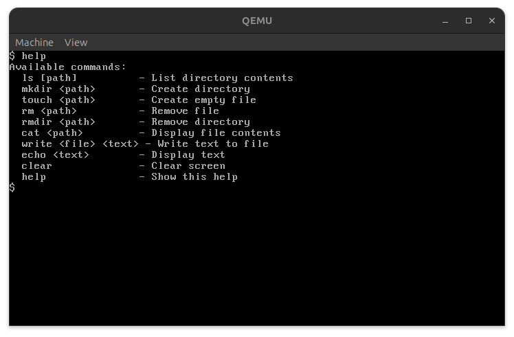

<h1 align="center">
    <picture>
        <source media="(prefers-color-scheme: light)" srcset="assets/logo.png">
        <source media="(prefers-color-scheme: dark)" srcset="assets/logo.png">
        
    </picture>
</h1>

<p align="center">
    <br>
    <a href="https://github.com/faishal882/uqaabOS">
        
    </a>
    <a href="https://github.com/faishal882/uqaabOS">
        
    </a>
</p>


UqaabOS is a foundational operating system developed entirely from scratch, adhering to a **Monolithic Kernel Architecture**. It is a passion-driven project aimed at gaining deeper insights into **Kernel Development.** Designed and build with emphasis on learning and understanding the inner workings of an operating system via practical implementation.



## 🚀 Features

-   **Hardware Support**:
    -   [Drivers](docs/drivers_doc.md): Support for Keyboard, Mouse, VGA, and ATA.
    -   [Interrupts](docs/interrupt_docs.md): Handling for hardware interrupts and exceptions.
    -   [GDT](docs/gdt_doc.md): Global Descriptor Table for memory segmentation.
-   **Memory Management**:
    -   [Memory Management](docs/memory_management_doc.md): Basic memory management functionalities.
-   **Multitasking**:
    -   [Multitasking](docs/multitasking_docs.md): Cooperative multitasking to run multiple tasks.
-   **File System**:
    -   [FAT32](docs/fat32_doc.md): Support for the FAT32 file system.
-   **Terminal**:
    -   [Terminal](docs/TERMINAL_DOC.md): A command-line interface for interacting with the OS.

## 🎬 Demo

<video src="assets/demo_video.webm" width="800" controls autoplay loop muted>
</video>

## 🛠️ Running UqaabOS

### Prerequisites

You will need the following tools:

-   `make`
-   `nasm`
-   `qemu-system-i386`
-   `grub-mkrescue`
-   An `i686-elf` cross-compiler toolchain (`gcc`, `g++`, `ld`)

### Building and Running

1.  **Clone the repository:**
    ```bash
    git clone https://github.com/faishal882/uqaabOS.git
    cd uqaabOS
    ```

2.  **Build the OS:**
    ```bash
    make 
    ```
    This will create the `build/uqaabOS.iso` file.

3.  **Run with QEMU:**
    ```bash
    qemu-system-i386 -cdrom build/uqaabOS.iso
    ```

4. **Run with the virtual harddrive attached**
    ```bash
    qemu-system-i386 -cdrom build/uqaabOS.iso -drive file=hdd.img,format=raw -boot d
    ```

## 👥 Contributors

-   **[Faishal](https://github.com/faishal882)**
-   **[Md Nadim Uddin](https://github.com/MdNadimUddin01)**

<div align="center">
Made with ❤️ by the UqaabOS Team
</div>