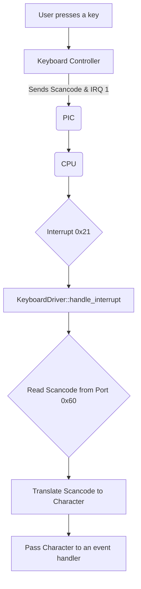
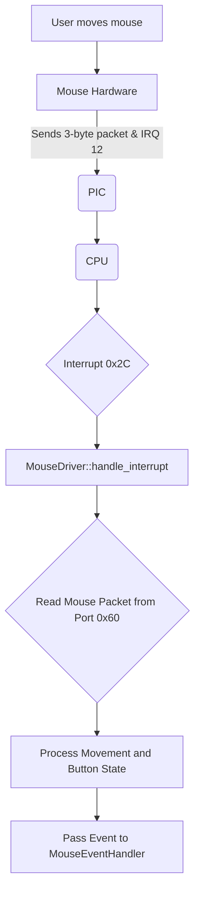
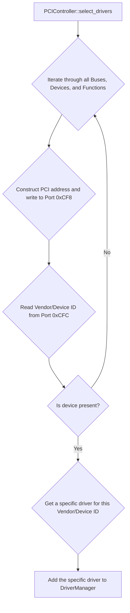
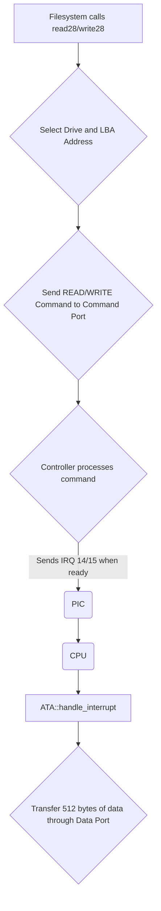
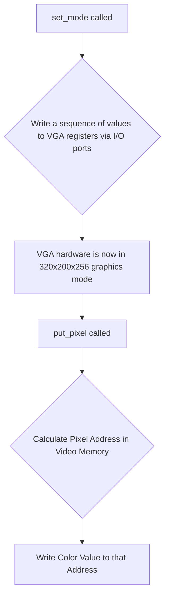

# Driver Documentation for uqaabOS

## Introduction

This document provides a detailed overview of the various hardware drivers implemented in uqaabOS. Drivers are essential software components that act as a bridge between the operating system and the hardware, allowing the kernel to control and communicate with devices such as keyboards, mice, and storage controllers. Each driver is designed to abstract the hardware's complexity, providing a clean interface to the rest of the kernel.

## Driver Manager

The `DriverManager` is a foundational class in uqaabOS for managing the lifecycle of all hardware drivers. It provides a centralized registry for drivers, simplifying their initialization and activation.

### Implementation Details

**`driver.h`**
```cpp
class DriverManager
{
private:
    Driver *drivers[365];
    int num_drivers;

public:
    DriverManager();
    void add_driver(Driver*);
    void activate_all();
};
```

**Explanation:**
-   `drivers`: A fixed-size array to hold pointers to all driver objects. This simple approach is sufficient for an early-stage OS where the number of drivers is known.
-   `num_drivers`: A counter to keep track of the number of drivers that have been added.
-   `add_driver()`: This method is called by the kernel during initialization to register a new driver. It simply adds the driver's pointer to the `drivers` array and increments the counter.
-   `activate_all()`: After all drivers have been added, the kernel calls this method. It iterates through the registered drivers and calls their respective `activate()` methods, ensuring that each piece of hardware is properly initialized and ready for use.

---

## Keyboard Driver

The keyboard driver is responsible for handling input from a standard PS/2 keyboard. It's a critical component for user interaction.

### Architecture and Flow

The keyboard driver is an interrupt-based driver. It doesn't poll the keyboard for input. Instead, it waits for the keyboard to send a signal (an interrupt) when a key is pressed or released. This is a highly efficient approach that allows the CPU to perform other tasks while waiting for user input.



### Implementation Details

**`keyboard.cpp`**
```cpp
KeyboardDriver::KeyboardDriver(interrupts::InterruptManager *manager,
                               KeyboardEventHandler *handler)
    : interrupts::InterruptHandler(manager, 0x21), data_port(0x60),
      command_port(0x64) {

  this->handler = handler;
}

uint32_t KeyboardDriver::handle_interrupt(uint32_t esp) {
  uint8_t key = data_port.read();
  // ... (scancode translation logic)
  return esp;
}

void KeyboardDriver::activate() {
  while (command_port.read() & 0x1)
    data_port.read();
  command_port.write(0xae); // activate interrupts
  command_port.write(0x20); // get current state
  uint8_t status = (data_port.read() | 1) & ~0x10;
  command_port.write(0x60); // set state
  data_port.write(status);
  data_port.write(0xf4); // enable keyboard
}
```

**Explanation:**
-   **Constructor:** The driver registers itself as the handler for interrupt `0x21` (which corresponds to IRQ 1, the keyboard's interrupt line). It also initializes `Port8Bit` objects for the keyboard's data and command ports (0x60 and 0x64).
-   `handle_interrupt()`: This is the core of the driver. When a keyboard interrupt occurs, this method is executed. It reads the "scancode" from the data port. This scancode is a raw value that represents the key that was pressed or released. The driver then translates this scancode into a more useful format (like an ASCII character) and passes it to the registered `KeyboardEventHandler`.
-   `activate()`: This method performs the keyboard's initialization sequence. It clears any pending data in the keyboard's buffer, sends a command to the keyboard controller to enable interrupts, and finally, sends a command to the keyboard itself to start scanning for key presses.

---

## Mouse Driver

The mouse driver handles input from a standard PS/2 mouse, enabling graphical user interaction.

### Architecture and Flow

Like the keyboard, the mouse driver is interrupt-driven. It listens for interrupt `0x2C` (IRQ 12). The mouse sends data in 3-byte packets, and the driver is responsible for assembling and interpreting these packets.



### Implementation Details

**`mouse.cpp`**
```cpp
MouseDriver::MouseDriver(interrupts::InterruptManager *manager,
                         MouseEventHandler *handler)
    : InterruptHandler(manager, 0x2C), data_port(0x60), command_port(0x64) {
  this->handler = handler;
}

uint32_t MouseDriver::handle_interrupt(uint32_t esp) {
  uint8_t status = command_port.read();
  if (!(status & 0x20))
    return esp;

  buffer[offset] = data_port.read();
  offset = (offset + 1) % 3;

  if (offset == 0) {
    handler->on_mouse_move(buffer[1], -buffer[2]);
    // ... (button handling)
  }
  return esp;
}

void MouseDriver::activate() {
  command_port.write(0xA8); // enable auxiliary device
  command_port.write(0x20); // get compaq status byte
  uint8_t status = data_port.read() | 2;
  command_port.write(0x60); // set compaq status byte
  data_port.write(status);
  command_port.write(0xD4); // write to auxiliary device
  data_port.write(0xF4); // enable mouse
  data_port.read(); // read ack
}
```

**Explanation:**
-   **Constructor:** Registers a handler for interrupt `0x2C` (IRQ 12), the standard interrupt for a PS/2 mouse.
-   `handle_interrupt()`: This method reads one byte of a 3-byte mouse packet. It uses an `offset` to keep track of which byte of the packet it's currently receiving. Once a full packet is received (`offset == 0`), it processes the data: `buffer[0]` contains button states, `buffer[1]` contains X-axis movement, and `buffer[2]` contains Y-axis movement. It then calls the appropriate methods on the `MouseEventHandler`.
-   `activate()`: This method sends a specific sequence of commands to the keyboard controller (which also manages the auxiliary PS/2 port) and the mouse itself to enable interrupts and start data reporting.

---

## PCI Controller

The PCI (Peripheral Component Interconnect) controller driver is a bus driver. Its job is not to control a specific device, but to scan the PCI bus and discover what devices are connected to the system.

### Architecture and Flow

The PCI driver operates by communicating with the PCI controller through I/O ports. It systematically scans all possible bus, device, and function combinations, reading the configuration space of each to identify the device.



### Implementation Details

**`pci.cpp`**
```cpp
PCIController::PCIController()
    : data_port(0xCFC), command_port(0xCF8) {}

uint32_t PCIController::read(uint16_t bus, uint16_t device, uint16_t function, uint32_t register_offset) {
  uint32_t id = 0x1 << 31
              | ((bus & 0xFF) << 16)
              | ((device & 0x1F) << 11)
              | ((function & 0x07) << 8)
              | (register_offset & 0xFC);
  command_port.write(id);
  return data_port.read();
}

void PCIController::select_drivers(DriverManager *driver_manager, uqaabOS::interrupts::InterruptManager *interrupt_manager) {
  for (int bus = 0; bus < 8; bus++) {
    for (int device = 0; device < 32; device++) {
      // ... (function iteration)
      PeripheralComponentInterconnectDeviceDescriptor dev = get_device_descriptor(bus, device, function);
      if (dev.vendor_id == 0x0000 || dev.vendor_id == 0xFFFF) continue;
      // ... (driver selection logic)
    }
  }
}
```

**Explanation:**
-   **Constructor:** Initializes the command and data ports (0xCF8 and 0xCFC). These two ports are the standard mechanism for accessing the PCI configuration space.
-   `read()`: This function is the heart of PCI communication. It constructs a 32-bit address that specifies the exact bus, device, function, and register to read from. This address is written to the command port, and the resulting data is then read from the data port.
-   `select_drivers()`: This is the main enumeration function. It systematically iterates through all possible PCI buses, devices, and functions. For each valid combination, it reads the vendor and device IDs. If a device is found (i.e., the vendor ID is not 0xFFFF), it attempts to find a suitable driver for that specific device and adds it to the `DriverManager`.

---

## ATA Driver

The ATA (Advanced Technology Attachment) driver provides an interface to IDE hard drives, which is essential for file storage.

### Architecture and Flow

The ATA driver communicates with the hard drive controller through a set of I/O ports. It sends commands to the controller to read, write, or identify the drive. While it can operate in a polling mode (constantly checking a status port), the uqaabOS implementation is interrupt-driven for efficiency.



### Implementation Details

**`ata.cpp`**
```cpp
ATA::ATA(uqaabOS::interrupts::InterruptManager* interrupt_manager, bool master, uint16_t port_base)
    : InterruptHandler(interrupt_manager, 0x20 + 14), // IRQ 14
      data_port(port_base), error_port(port_base + 0x1), // ...
{
  this->master = master;
}

void ATA::identify() {
  device_port.write(master ? 0xA0 : 0xB0);
  // ... (command sequence)
  command_port.write(0xEC); // IDENTIFY command
  // ... (read and print identification data)
}

void ATA::read28(uint32_t sector_num, uint8_t *data, uint32_t count) {
  device_port.write((master ? 0xE0 : 0xF0) | ((sector_num & 0x0F000000) >> 24));
  // ... (set sector count, LBA address)
  command_port.write(0x20); // READ SECTORS command
  // ... (wait for interrupt and read data)
}
```

**Explanation:**
-   **Constructor:** Registers a handler for IRQ 14 (the primary ATA channel) and initializes the set of I/O ports used by the ATA controller (data, error, sector count, LBA, etc.).
-   `identify()`: This function sends the `IDENTIFY` command (0xEC) to the drive. The drive responds with a 512-byte block of data containing information about itself, such as its model number, serial number, and capabilities.
-   `read28()`: This function implements the 28-bit LBA read protocol. It selects the drive (master or slave), sets the desired sector number and the number of sectors to read, and then sends the `READ SECTORS` command (0x20). The driver then waits for an interrupt, which signals that the data is ready to be read from the data port.

---

## VGA Driver

The VGA (Video Graphics Array) driver provides basic graphics capabilities, allowing the OS to draw pixels on the screen and move beyond simple text mode.

### Architecture and Flow

The VGA driver works by directly manipulating the VGA hardware through a set of I/O ports. To enter a graphics mode, it writes a specific sequence of values to the VGA's internal registers. To draw a pixel, it calculates the pixel's address in a special region of memory (video memory) and writes a color value there.



### Implementation Details

**`vga.cpp`**
```cpp
VideoGraphicsArray::VideoGraphicsArray()
    : misc_port(0x3c2), crtc_index_port(0x3d4), // ...
{}

bool VideoGraphicsArray::set_mode(uint32_t width, uint32_t height, uint32_t colordepth) {
  if (!supports_mode(width, height, colordepth)) return false;
  unsigned char g_320x200x256[] = { /* ... a long list of magic register values ... */ };
  write_registers(g_320x200x256);
  return true;
}

void VideoGraphicsArray::put_pixel(uint32_t x, uint32_t y, uint8_t colorIndex) {
  uint8_t *pixelAddress = get_frame_buffer_segment() + 320 * y + x;
  *pixelAddress = colorIndex;
}
```

**Explanation:**
-   **Constructor:** Initializes `Port8Bit` objects for the numerous I/O ports used to control the VGA hardware's miscellaneous, CRTC, sequencer, and other registers.
-   `set_mode()`: This function is responsible for switching from text mode to a graphics mode. For a given mode (in this case, 320x200 with 256 colors), there is a specific set of "magic values" that must be written to the VGA's internal registers in a precise order. This function contains these values and writes them using the `write_registers` helper function.
-   `put_pixel()`: Once in graphics mode, a region of the computer's physical memory starting at `0xA0000` is directly mapped to the pixels on the screen. This function calculates the exact memory address corresponding to an (x, y) pixel coordinate and writes a color value to that address, causing the pixel on the screen to light up with that color.