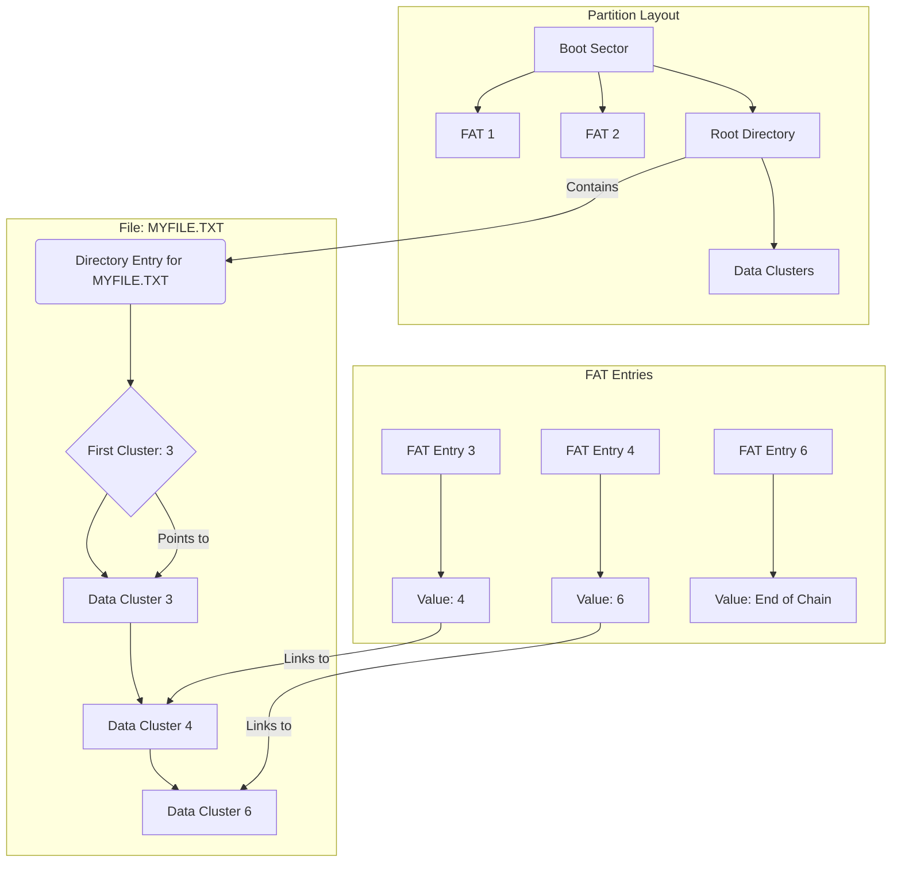
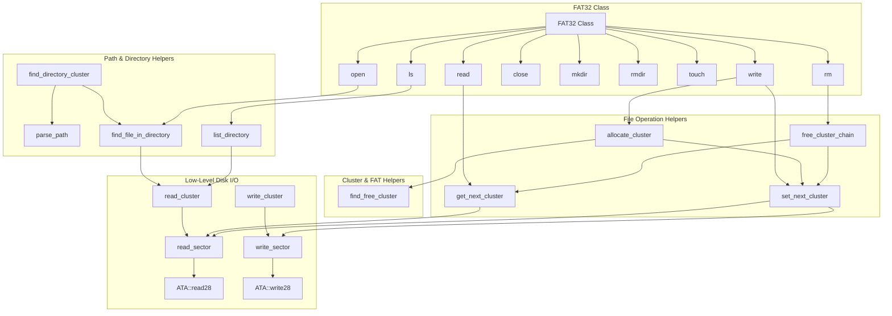
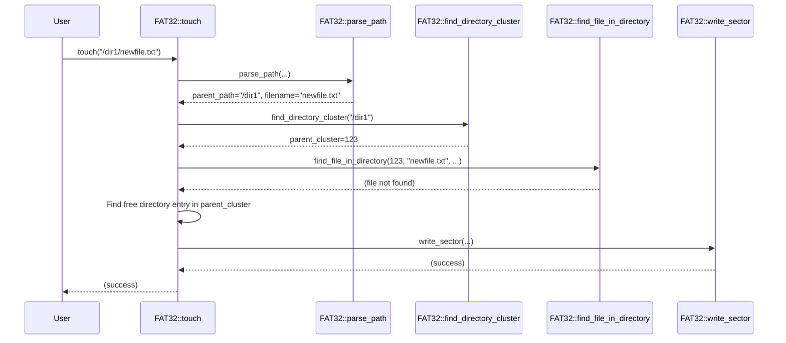
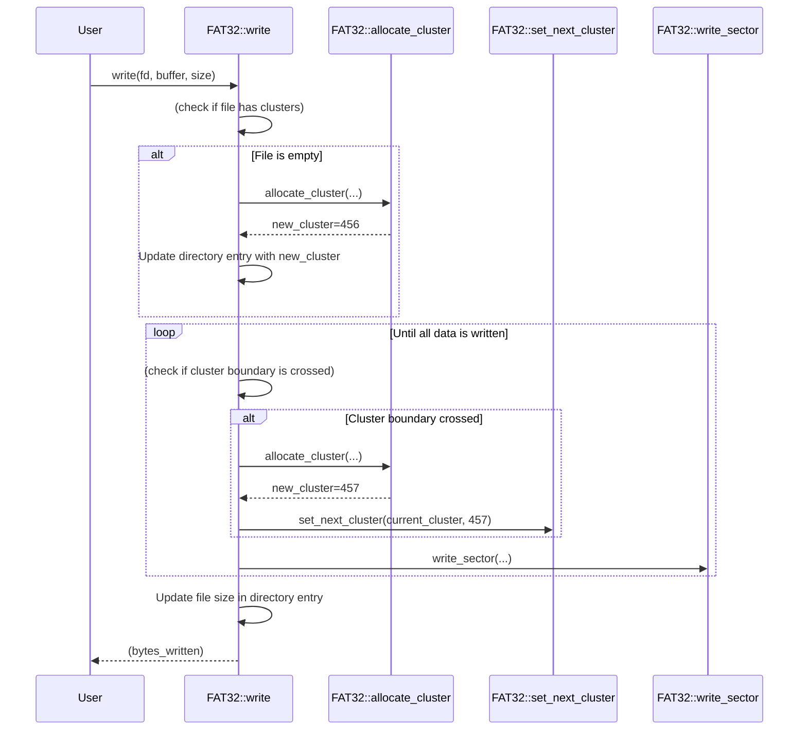

# FAT32 Implementation in uqaabOS

## Introduction

The FAT32 filesystem implementation in uqaabOS provides essential file and directory management capabilities. It allows the operating system to interact with a FAT32-formatted partition, enabling operations such as creating, deleting, and modifying files and directories.

This document provides a detailed explanation of how these operations are implemented in the uqaabOS codebase.

## Architecture

The FAT32 implementation in uqaabOS is built around a few key components:

-   **`FAT32` Class:** The main class that encapsulates all the logic for interacting with the FAT32 filesystem.
-   **`BiosParameterBlock32` (BPB):** A structure that holds the BIOS Parameter Block, which contains essential information about the filesystem's layout.
-   **File Allocation Table (FAT):** A table that keeps track of which clusters are allocated to which files.
-   **Data Clusters:** The actual blocks of storage where file and directory data is stored.
-   **`DirectoryEntryFat32`:** A structure that represents a file or directory entry.

### FAT32 File System



### Class Interaction



## Key Data Structures

### `FileDescriptor`

The `FileDescriptor` structure holds information about a file that is currently open. It is used to keep track of the file's state, such as its current position, size, and which clusters it is using.

```cpp
struct FileDescriptor {
    char name[256];
    uint32_t parent_cluster;
    uint32_t first_cluster;
    uint32_t current_cluster;
    uint32_t current_sector_in_cluster;
    uint32_t size;
    uint32_t position;
    bool is_open;
};
```

-   `name`: The name of the file.
-   `parent_cluster`: The cluster number of the parent directory.
-   `first_cluster`: The first cluster of the file's data.
-   `current_cluster`: The cluster that the file pointer is currently in.
-   `current_sector_in_cluster`: The sector within the current cluster that the file pointer is in.
-   `size`: The total size of the file in bytes.
-   `position`: The current position of the file pointer.
-   `is_open`: A flag indicating whether the file descriptor is in use.

### `BiosParameterBlock32`

The `BiosParameterBlock32` (BPB) is a critical data structure located in the first sector of the FAT32 partition. It contains essential information about the filesystem's layout, such as the number of bytes per sector, sectors per cluster, and the location of the FATs.

```cpp
struct BiosParameterBlock32 {
  uint8_t jump[3];
  uint8_t soft_name[8];
  uint16_t bytes_per_sector;
  uint8_t sector_per_cluster;
  uint16_t reserved_sectors;
  uint8_t fat_copies;
  // ... and so on
} __attribute__((packed));
```

### `DirectoryEntryFat32`

The `DirectoryEntryFat32` structure represents a single entry in a directory. It contains metadata about a file or subdirectory, such as its name, attributes, size, and the first cluster of its data.

```cpp
struct DirectoryEntryFat32 {
  uint8_t name[8];
  uint8_t ext[3];
  uint8_t attributes;
  // ...
  uint16_t first_cluster_hi;
  uint16_t first_cluster_low;
  uint32_t size;
} __attribute__((packed));
```

-   `name` and `ext`: The 8.3 filename and extension.
-   `attributes`: A bitfield that specifies the attributes of the entry (e.g., read-only, hidden, directory).
-   `first_cluster_hi` and `first_cluster_low`: The high and low 16 bits of the first cluster number.
-   `size`: The size of the file in bytes (0 for directories).

## Implementation Details

### Path Parsing and Traversal

Path parsing is handled by `parse_path`, which splits a full path into a parent directory path and a filename/directory name. For example, `/dir1/file.txt` would be split into `/dir1` and `file.txt`.

Directory traversal is performed by `find_directory_cluster`. This function takes a path and traverses the directory tree from the root to find the starting cluster of the target directory. It does this by repeatedly calling `find_file_in_directory` for each component of the path.

### Cluster Allocation and Deallocation

- **`allocate_cluster`**: This function finds a free cluster in the FAT, marks it as allocated (as the end of a chain), and returns its number. It does this by calling `find_free_cluster` to scan the FAT for an entry with the value `0x00000000` and then `set_next_cluster` to update the entry to `0x0FFFFFFF`.
- **`free_cluster_chain`**: This function frees a chain of clusters by iterating through the FAT and setting each entry in the chain to `0x00000000`.

### File Creation

Creating a new, empty file is handled by the `touch` function. This operation doesn't allocate any data clusters yet; it only creates the metadata for the file in the parent directory.



1.  **Path Parsing:** The `touch` function first calls `parse_path` to split the full path into a parent directory path and a filename.
2.  **Parent Directory Lookup:** It then calls `find_directory_cluster` to get the starting cluster of the parent directory.
3.  **Check for Existing File:** The system calls `find_file_in_directory` to check if a file with the same name already exists. If it does, the operation is aborted.
4.  **Find Free Directory Entry:** The code iterates through the parent directory's cluster(s), looking for a directory entry whose first byte is either `0x00` (end of directory) or `0xE5` (deleted entry). This is a free slot where the new file's entry can be placed.
5.  **Create Directory Entry:** A new `DirectoryEntryFat32` is created in the free slot. The filename is formatted to the 8.3 standard (e.g., `MYFILE.TXT`), the file size is set to 0, and the `first_cluster` is set to 0. The "archive" attribute (`0x20`) is set, which is a standard practice for new files.
6.  **Write to Disk:** The sector containing the new directory entry is written back to the disk using `write_sector`.

### File Deletion

Deleting a file is handled by the `rm` function. This operation frees the data clusters used by the file and marks its directory entry as deleted.

1.  **Path Parsing:** The `rm` function parses the path to get the parent directory and filename.
2.  **Find File Entry:** It then finds the `DirectoryEntryFat32` for the file to be deleted.
3.  **Free Cluster Chain:** The `free_cluster_chain` function is called with the file's first cluster. This function iterates through the file's cluster chain in the FAT, setting each entry to `0x00000000` to mark it as free. For example, if the file uses clusters 5, 8, and 12, the FAT entries for clusters 5 and 8 will be updated to point to 8 and 12 respectively, and the entry for cluster 12 will be marked as end-of-chain. `free_cluster_chain` will set the FAT entries for clusters 5, 8, and 12 to 0.
4.  **Mark as Deleted:** The first byte of the file's directory entry is set to `0xE5`. This is a special marker that indicates to the filesystem that the entry is deleted and can be overwritten.
5.  **Write to Disk:** The updated directory entry is written back to the disk.

### Folder Creation

Creating a new folder is handled by the `mkdir` function. This is more complex than creating a file because a new data cluster must be allocated for the folder's contents.

1.  **Path Parsing:** The `mkdir` function parses the path to get the parent directory and the new directory name.
2.  **Parent Directory Lookup:** It finds the cluster of the parent directory.
3.  **Check for Existing Directory:** It checks if a directory with the same name already exists.
4.  **Allocate Cluster:** A new cluster is allocated for the new directory using `allocate_cluster`. This function finds a free cluster in the FAT and marks it as the end of a chain (`0x0FFFFFFF`).
5.  **Create `.` and `..` Entries:** Two special directory entries are created in the new cluster:
    *   `.` (dot), which points to the new directory itself. Its `first_cluster` is set to the newly allocated cluster.
    *   `..` (dot-dot), which points to the parent directory. Its `first_cluster` is set to the parent directory's cluster.
6.  **Create Directory Entry:** A new directory entry for the new folder is created in the parent directory. Its `first_cluster` is set to the newly allocated cluster, and the "directory" attribute (`0x10`) is set.
7.  **Write to Disk:** The new directory cluster (with the `.` and `..` entries) and the updated parent directory entry are written to the disk.

### Folder Deletion

Deleting a folder is handled by the `rmdir` function. This can be a recursive operation.

1.  **Path Parsing:** The `rmdir` function parses the path to get the parent directory and the directory to be deleted.
2.  **Find Directory Entry:** It finds the directory entry for the folder to be deleted.
3.  **Check if Empty:** The system checks if the directory is empty (contains only `.` and `..` entries). If it's not empty, it recursively calls `rm` for each file and `rmdir` for each subdirectory.
4.  **Free Cluster Chain:** The cluster chain of the directory is freed using `free_cluster_chain`.
5.  **Mark as Deleted:** The directory entry is marked as deleted by setting the first byte to `0xE5`.
6.  **Write to Disk:** The updated directory entry is written back to the disk.

### Reading From Files

The `read` function reads a specified number of bytes from an open file into a buffer. It uses the file descriptor to keep track of the current position within the file.

1.  **Find File Descriptor:** The `read` function gets the file descriptor corresponding to the file handle.
2.  **Calculate Sector and Offset:** It calculates the current sector and the offset within that sector based on the file's current position.
3.  **Read Sector:** It reads the sector from the disk.
4.  **Copy Data:** It copies the data from the sector buffer to the user-provided buffer.
5.  **Advance Position:** It updates the file's position and the current cluster/sector if a boundary is crossed.
6.  **Follow Cluster Chain:** If the read operation needs to continue into the next cluster, it calls `get_next_cluster` to find the next cluster in the chain.

### Writing to Files

Writing to a file is handled by the `write` function. This is the most complex operation, as it may involve allocating new clusters and updating the FAT.



1.  **Find File Descriptor:** The `write` function first finds the file descriptor for the file to be written to.
2.  **Allocate Cluster (if needed):** If the file is empty (`first_cluster` is 0), a new cluster is allocated for it, and the file's directory entry is updated.
3.  **Find Sector:** The system calculates the correct sector to write to based on the file's current position.
4.  **Read-Modify-Write:** The sector is read from the disk to preserve any existing data. The new data is then copied into the sector buffer at the correct offset.
5.  **Write Sector:** The updated sector is written back to the disk.
6.  **Update File Size:** The file's size is updated in its directory entry.
7.  **Allocate New Cluster (if needed):** If the write operation crosses a cluster boundary, a new cluster is allocated using `allocate_cluster`. The FAT is then updated to link the new cluster to the existing cluster chain. For example, if the file was using cluster 5, and a new cluster 9 is allocated, the FAT entry for cluster 5 is updated to point to 9, and the FAT entry for cluster 9 is marked as the new end-of-chain.

## Code Index

The following files are relevant to the FAT32 filesystem implementation in uqaabOS:

-   `src/include/filesystem/fat32.h`: Defines the `FAT32` class and related structures.
-   `src/include/filesystem/fat.h`: Defines the `BiosParameterBlock32` and `DirectoryEntryFat32` structures.
-   `src/filesystem/fat32.cpp`: Implements the core logic of the `FAT32` class.
-   `src/filesystem/fat32_operations.cpp`: Implements the high-level file and directory operations.
-   `src/filesystem/fat32_path_helpers.cpp`: Implements helper functions for path parsing and traversal.
-   `src/filesystem/fat32_write_helpers.cpp`: Implements helper functions for writing to the filesystem.