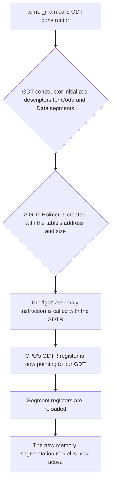

# Global Descriptor Table (GDT) in uqaabOS

## Introduction

The Global Descriptor Table (GDT) is a relic of the x86 architecture's evolution, primarily designed for memory segmentation. In the early days of computing, segmentation was a key mechanism for memory management and protection, allowing an operating system to isolate processes from one another by giving them their own memory segments. Before entering "protected mode," the CPU operates in "real mode," which has a very limited 1MB address space. The GDT is the primary mechanism that enables the switch to protected mode, unlocking the full 32-bit address space and providing hardware-level security features.

Each entry in the GDT, a "segment descriptor," defines a memory segment's base address, its size (limit), and its access rights (e.g., readable, writable, executable, privilege level). While modern operating systems (including uqaabOS) primarily use paging for memory management and protection, a valid GDT is still required to be present to operate in protected mode. Therefore, uqaabOS sets up a basic "flat memory model," where the code and data segments span the entire 4GB address space, effectively creating a flat address space while still maintaining the required segmentation structures for x86 compatibility.

## GDT Structure in uqaabOS

The GDT in uqaabOS is implemented using two main classes:

-   **`GDTDescriptor`:** Represents a single 8-byte entry (segment descriptor) in the GDT.
-   **`GDT`:** Represents the entire Global Descriptor Table, which is essentially an array of `GDTDescriptor` objects.

### GDT Layout

The GDT in uqaabOS is configured with four essential segments:

1.  **Null Segment:** The first descriptor in the GDT must be a null descriptor. Any attempt to load a segment register with a selector pointing to this descriptor will result in a general protection fault. This is a safety feature.
2.  **Unused Segment:** An unused segment descriptor.
3.  **Code Segment:** A segment for kernel-level code (Ring 0).
4.  **Data Segment:** A segment for kernel-level data and stack (Ring 0).

## Architecture and Initialization

The GDT is one of the first structures to be initialized by the kernel. The `GDT` class constructor handles the entire process of setting up the segment descriptors and loading the GDT into the processor.

### GDT Loading Process

The following diagram illustrates the process of initializing and loading the GDT in uqaabOS:



## Implementation Details

### GDTDescriptor Class

The `GDTDescriptor` class is a C++ representation of the 8-byte structure that the x86 CPU expects for each GDT entry.

**`gdt.h`**
```cpp
class GDTDescriptor {
private:
  uint16_t low_limit;
  uint16_t low_base;
  uint8_t mid_base;
  uint8_t access;
  uint8_t granularity; // high 4 bits (flags) low 4 bits (limit)
  uint8_t high_base;

public:
  GDTDescriptor(uint32_t base, uint32_t limit, uint8_t access);
  // ...
} __attribute__((packed));
```

**`gdt.cpp`**
```cpp
GDTDescriptor::GDTDescriptor(uint32_t base, uint32_t limit, uint8_t access)
{
  uint8_t *target = (uint8_t *)this;

  if ((limit & 0xFFF) != 0xFFF)
    limit = (limit >> 12) - 1;
  else
    limit = limit >> 12;

  target[6] = 0xC0; // Set Granularity and 32-bit mode flags

  target[0] = limit & 0xFF;
  target[1] = (limit >> 8) & 0xFF;
  target[6] |= (limit >> 16) & 0xF;

  target[2] = base & 0xFF;
  target[3] = (base >> 8) & 0xFF;
  target[4] = (base >> 16) & 0xFF;
  target[7] = (base >> 24) & 0xFF;

  target[5] = access;
}
```
**Explanation:**
The constructor for `GDTDescriptor` is a masterful piece of bit-level manipulation required to conform to the x86 architecture. It takes a 32-bit base address, a 32-bit limit, and an 8-bit access byte and packs them into the convoluted 8-byte descriptor format.

-   **Limit Encoding:** The 32-bit limit is squeezed into 20 bits. If the limit is page-granular (in 4KB units), it's shifted right by 12 bits.
-   **Granularity (`target[6]`):** The value `0xC0` sets two important flags: the Granularity flag (G) to 1, which means the limit is scaled by 4KB, and the Size flag (D/B) to 1, indicating a 32-bit protected mode segment.
-   **Base and Limit Packing:** The rest of the code meticulously places the bits of the `base` and `limit` into their designated byte and bit locations within the 8-byte `target` array.
-   **Access Byte (`target[5]`):** This byte is set directly and defines the segment's properties.

### GDT Class

The `GDT` class encapsulates the entire table and its initialization.

**`gdt.cpp`**
```cpp
GDT::GDT()
    : null_segment(0, 0, 0), unused_segment(0, 0, 0),
      code_segment(0, 64 * 1024 * 1024, 0x9A),
      data_segment(0, 64 * 1024 * 1024, 0x92)
{
  // ... (GDT pointer setup)

  asm volatile(
      "lgdt %0"
      :
      : "m"(gdt_ptr)
      : "memory");
}
```
**Explanation:**
The `GDT` constructor is where the segments are actually defined.
-   `code_segment(0, 64 * 1024 * 1024, 0x9A)`: This creates the kernel code segment.
    -   `base`: 0
    -   `limit`: 64MB
    -   `access` (`0x9A`): This translates to `10011010` in binary, which means: Present (1), Privilege Level 0 (00), Descriptor Type 1 (1), Executable (1), Direction/Conforming 0 (0), Readable (1), Accessed 0 (0). In short, a Ring 0, executable and readable code segment.
-   `data_segment(0, 64 * 1024 * 1024, 0x92)`: This creates the kernel data segment.
    -   `base`: 0
    -   `limit`: 64MB
    -   `access` (`0x92`): This translates to `10010010` in binary, which means: Present (1), Privilege Level 0 (00), Descriptor Type 1 (1), Not Executable (0), Direction 0 (0), Writable (1), Accessed 0 (0). In short, a Ring 0, readable and writable data segment.
-   `lgdt`: This assembly instruction loads the address and size of our GDT into the CPU's GDTR register, making it the active GDT for the system.

### How Segment Selectors Are Used

The `code_segment_selector()` and `data_segment_selector()` methods are crucial because they provide the values that need to be loaded into the segment registers (`CS`, `DS`, `SS`, etc.) to activate a segment. A selector is an index into the GDT.

**`gdt.cpp`**
```cpp
uint16_t GDT::code_segment_selector()
{
  return (uint8_t *)&code_segment - (uint8_t *)this;
}
```
**Usage Example (from `interrupts.cpp`):**
```cpp
InterruptManager::InterruptManager(uint16_t hardware_interrupt_offset,
                                   uqaabOS::include::GDT *gdt,
                                   multitasking::TaskManager *task_manager)
{
  // ...
  uint32_t code_segment = gdt->code_segment_selector();
  // ...
  setGateDescriptor(..., code_segment, ...);
}
```
Here, the `InterruptManager` needs to tell the CPU which code segment to use when an interrupt occurs. It calls `gdt->code_segment_selector()` to get the correct selector for the kernel's code segment and embeds this selector into the Interrupt Descriptor Table (IDT) entries. This ensures that all interrupt handlers run in Ring 0 with the correct code segment active.

## Code Index

The following files are relevant to the GDT implementation in uqaabOS:

-   `src/include/gdt.h`: Defines the `GDT` and `GDTDescriptor` classes.
-   `src/core/gdt.cpp`: Implements the `GDT` and `GDTDescriptor` classes.
-   `src/kernel.cpp`: Initializes the `GDT` during the kernel's entry sequence.