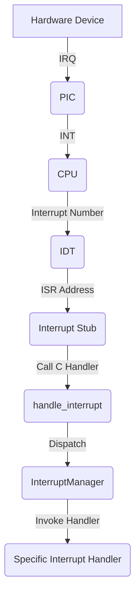
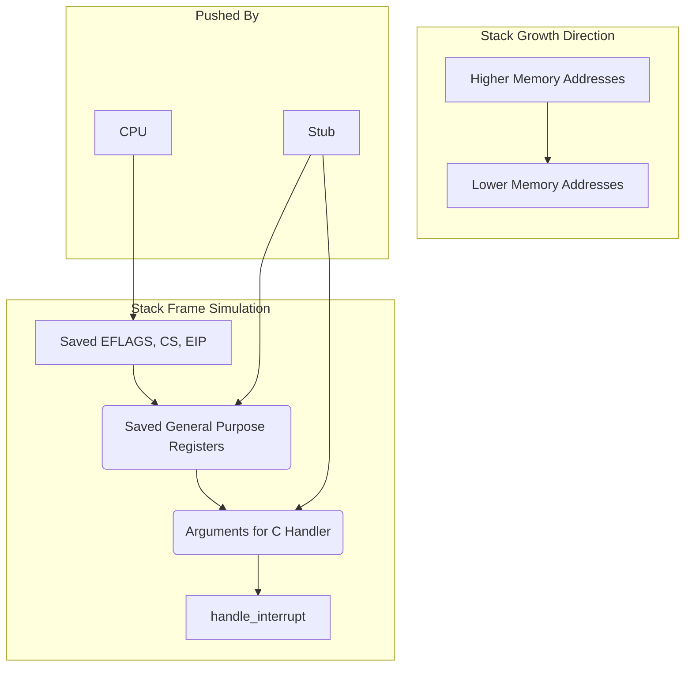

# Interrupt Handling in uqaabOS

## Introduction

In the realm of operating systems, an interrupt is a signal to the processor emitted by hardware or software, indicating an event that needs immediate attention. Interrupts are a cornerstone of modern computing, enabling efficient and responsive systems. They were introduced to move away from the inefficient method of "polling," where the CPU would waste countless cycles repeatedly checking the status of a device. With interrupts, the CPU can continue with its tasks and only switch to handle a device when the device itself signals that it's ready.

This mechanism is fundamental for multitasking, allowing the OS to switch between different tasks and handle I/O operations without halting the entire system. In uqaabOS, the interrupt handling system is meticulously designed to manage these signals, dispatch them to the appropriate handlers, and ensure the stability and responsiveness of the system. This document provides a comprehensive overview of the interrupt handling architecture and implementation in uqaabOS.

## Architecture

The interrupt handling in uqaabOS is designed around the Intel 8259 Programmable Interrupt Controller (PIC) and the Interrupt Descriptor Table (IDT). The architecture can be broken down into the following key components:

- **Interrupt Descriptor Table (IDT):** A data structure used by the x86 architecture to store entry points for interrupt service routines (ISRs).
- **Interrupt Service Routines (ISRs):** Functions that are executed in response to a specific interrupt.
- **Programmable Interrupt Controller (PIC):** A chip that manages hardware interrupts and signals the CPU when an interrupt occurs.
- **Interrupt Manager:** A high-level abstraction that initializes and manages the IDT, PIC, and interrupt handlers.
- **Interrupt Handlers:** Objects that encapsulate the logic for handling specific interrupts.

### Interrupt Flow

The following flowchart illustrates the flow of an interrupt from the hardware to the corresponding handler in uqaabOS:



### Detailed Flow Description

1.  A hardware device (e.g., keyboard, mouse) raises an Interrupt Request (IRQ) line.
2.  The PIC receives the IRQ, prioritizes it, and sends an interrupt signal (INT) to the CPU.
3.  The CPU acknowledges the interrupt and requests the interrupt number from the PIC.
4.  The CPU uses the interrupt number as an index into the IDT to find the corresponding ISR address.
5.  The CPU jumps to the address of the interrupt stub (`interruptstub.asm`).
6.  The interrupt stub saves the current CPU state and calls the generic C interrupt handler (`handle_interrupt` in `interrupts.cpp`).
7.  The `handle_interrupt` function calls the `do_handle_interrupt` method of the active `InterruptManager`.
8.  The `InterruptManager` dispatches the interrupt to the appropriate `InterruptHandler` based on the interrupt number.
9.  The specific `InterruptHandler` (e.g., `KeyboardDriver`, `MouseDriver`) executes its logic to handle the interrupt.

## Stack Frame and Return

When an interrupt occurs, the CPU and the interrupt handler work together to save the current state of the machine so that it can be resumed after the interrupt is handled. This is done by pushing values onto the stack. The layout of the stack during an interrupt is crucial for a stable return.

### The Interrupt Stack Frame

The following diagram illustrates the state of the stack when the C-level interrupt handler is called:



**Explanation of the Stack Frame:**

1.  **Pushed by the CPU:** When an interrupt is triggered, the CPU automatically pushes the `EFLAGS` register, the Code Segment (`CS`) register, and the Instruction Pointer (`EIP`) onto the stack. This is the minimal context required to return to the interrupted code.
2.  **Pushed by the Stub:** The assembly stub in `interruptstub.asm` then pushes the general-purpose registers to save the full context of the interrupted task. It then pushes the arguments for our C-level handler, which are the interrupt number and the current stack pointer.

### Returning from an Interrupt

After the interrupt handler has finished its execution, the `iret` instruction is used to return from the interrupt. This instruction performs the reverse operation of the interrupt call:

1.  It pops the `EIP`, `CS`, and `EFLAGS` registers from the stack, effectively resuming the interrupted code at the exact point where it left off.
2.  If a privilege level change occurred, it also pops the stack pointer (`ESP`) and stack segment (`SS`).

This mechanism ensures that the interrupted task can continue its execution without any knowledge of the interrupt that occurred.

## Implementation Details

### Interrupt Descriptor Table (IDT)

The IDT is initialized in the `InterruptManager` constructor. The `setGateDescriptor` function is used to populate the IDT with entries for both hardware interrupts and CPU exceptions.

**`interrupts.cpp`**
```cpp
void InterruptManager::setGateDescriptor(uint8_t interrupt,
                                         uint16_t code_seg_selector_offset,
                                         void (*handler)(),
                                         uint8_t desc_privilege_level,
                                         uint8_t desc_type) {
  // set ISR(Interrupt Service Routine)
  idt_entries[interrupt].low_offset = ((uint32_t)handler) & 0xFFFF;
  idt_entries[interrupt].high_offset = (((uint32_t)handler) >> 16) & 0xFFFF;

  // set code segment of the ISR
  idt_entries[interrupt].code_seg_selector = code_seg_selector_offset;
  idt_entries[interrupt].zero = 0;

  // set privilege level
  const uint8_t IDT_DESC_PRESENT = 0x80; // binary: 1000 0000
  idt_entries[interrupt].type =
      IDT_DESC_PRESENT | ((desc_privilege_level & 3) << 5) | (desc_type & 0xF);
}
```
**Explanation:**
This function sets up a single entry in the IDT. It takes the interrupt number, the code segment selector, a pointer to the handler function, the privilege level, and the descriptor type as arguments. It populates the `GateDescriptor` structure with this information, which the CPU will use to handle the interrupt.

### Interrupt Service Routines (ISRs)

The low-level ISRs are defined in `interruptstub.asm`. These stubs are responsible for saving the CPU state, calling the C-level interrupt handler, and restoring the state after the interrupt has been handled.

**`interruptstub.asm`**
```assembly
; Macro for handling IRQ (hardware interrupts)
%macro HandleInterruptRequest 1
global IRQ%1                               ; Make the IRQ handler visible to linker
IRQ%1:
    mov dword [interrupt_number], (%1 + IRQ_BASE)  ; Store IRQ number offset by base
    push 0                                 ; Push a dummy error code (0) for consistency
    jmp int_bottom                         ; Jump to common handler code
%endmacro

; ...

; Common interrupt handling code
int_bottom:
    ; Save registers
    push ebp
    push edi
    push esi
    push edx
    push ecx
    push ebx
    push eax

    ; Call the C handler function
    push esp                            ; Push stack pointer as parameter
    push dword [interrupt_number]        ; Push interrupt number as parameter
    call handle_interrupt               ; Call C handler function
    mov esp, eax                        ; Update stack pointer from return value

    ; Restore registers
    pop eax
    pop ebx
    pop ecx
    pop edx
    pop esi
    pop edi
    pop ebp

    ; Clean up the stack (error code or dummy value)
    add esp, 4

    ; Return from interrupt
    iret
```
**Explanation:**
The `HandleInterruptRequest` macro generates a unique handler for each IRQ. This handler pushes a dummy error code (for consistency with exceptions that do push an error code) and jumps to a common `int_bottom` section. `int_bottom` saves all the general-purpose registers, calls the main C `handle_interrupt` function, and then restores the registers before returning from the interrupt with `iret`.

### Programmable Interrupt Controller (PIC)

The PIC is initialized and remapped in the `InterruptManager` constructor to avoid conflicts with CPU exceptions.

**`interrupts.cpp`**
```cpp
// Initialize PIC
PIC_master_command_port.write(0x11);
PIC_slave_command_port.write(0x11);
// Remap the Interrupt Numbers
PIC_master_data_port.write(hardware_interrupt_offset);
PIC_slave_data_port.write(hardware_interrupt_offset + 8);
// Setup PIC Master-Slave Connection
PIC_master_data_port.write(0x04);
PIC_slave_data_port.write(0x02);
// Set PIC Mode
PIC_master_data_port.write(0x01);
PIC_slave_data_port.write(0x01);
// Clear Data Registers
PIC_master_data_port.write(0x00);
PIC_slave_data_port.write(0x00);
```
**Explanation:**
This code initializes the master and slave PICs. The `0x11` command starts the initialization sequence. The PICs are then remapped to a different offset in the IDT (to avoid conflicts with CPU exceptions), configured in master-slave mode, and set to 8086/88 mode. Finally, the data registers are cleared.

### Interrupt Manager

The `InterruptManager` class is the central component of the interrupt handling system. It is responsible for:

-   Initializing the IDT and PIC.
-   Managing interrupt handlers.
-   Activating and deactivating interrupts.
-   Dispatching interrupts to the appropriate handlers.

**`interrupts.h`**
```cpp
class InterruptManager {
public:
  static InterruptManager *ActiveInterrruptManager;
  InterruptHandler *handlers[256];
  multitasking::TaskManager* task_manager;

  // ...

  InterruptManager(uint16_t hardware_interrupt_offset,
                   uqaabOS::include::GDT *gdt , multitasking::TaskManager* task_manager);
  ~InterruptManager();

  uint16_t hardwareInterruptOffset();
  void activate();   // activate the interrupts
  void deactivate(); // deactivate the interrupts
  uint32_t do_handle_interrupt(uint8_t interrupt_number, uint32_t esp);
};
```
**Explanation:**
The `InterruptManager` class holds an array of `InterruptHandler` pointers, one for each possible interrupt. The `activate` and `deactivate` methods control the global interrupt flag, while `do_handle_interrupt` is the main dispatch function that calls the appropriate handler.

### Interrupt Handlers

Interrupt handlers are classes that inherit from `InterruptHandler` and implement the `handle_interrupt` method. These handlers are registered with the `InterruptManager` for a specific interrupt number.

**`keyboard.cpp`**
```cpp
KeyboardDriver::KeyboardDriver(interrupts::InterruptManager *manager,
                               KeyboardEventHandler *handler)
    : interrupts::InterruptHandler(manager, 0x21), data_port(0x60),
      command_port(0x64) {

  this->handler = handler;
}

uint32_t KeyboardDriver::handle_interrupt(uint32_t esp) {
  uint8_t key = data_port.read();
  // ... handle keyboard input ...
  return esp;
}
```
**Explanation:**
The `KeyboardDriver` is an `InterruptHandler` for interrupt `0x21` (the keyboard IRQ). When a keyboard interrupt occurs, its `handle_interrupt` method is called, which reads the scancode from the keyboard's data port and processes it.

**`mouse.cpp`**
```cpp
MouseDriver::MouseDriver(interrupts::InterruptManager *manager,
                         MouseEventHandler *handler)
    : InterruptHandler(manager, 0x2C), // Initialize with IRQ 0x2C for mouse
      data_port(0x60),                 // Port for mouse data
      command_port(0x64) {             // Port for mouse commands
  this->handler = handler;             // Store the event handler
}

uint32_t MouseDriver::handle_interrupt(uint32_t esp) {
  uint8_t status = command_port.read();
  if (!(status & 0x20))
    return esp;

  buffer[offset] = data_port.read();
  // ... handle mouse input ...
  return esp;
}
```
**Explanation:**
Similarly, the `MouseDriver` handles interrupt `0x2C` (the mouse IRQ). Its `handle_interrupt` method reads the mouse data from the data port and processes it, updating the cursor position and button states.

## Advanced Interrupt Topics

### Interrupt Masking

Interrupt masking is the practice of temporarily disabling certain interrupts. This is crucial in situations where the kernel needs to perform an atomic operation that should not be interrupted. In uqaabOS, this is achieved using the `cli` (Clear Interrupt Flag) and `sti` (Set Interrupt Flag) assembly instructions, which are wrapped in the `deactivate()` and `activate()` methods of the `InterruptManager`.

### Interrupt Nesting

Interrupt nesting occurs when a new interrupt arrives while the CPU is already handling a previous one. The ability to handle nested interrupts depends on whether the interrupt flag is re-enabled within the ISR. In the current implementation of uqaabOS, the interrupt flag is not re-enabled until the end of the interrupt handler, so interrupts are not nested.

### Spurious Interrupts

A spurious interrupt is a hardware interrupt for which the source cannot be determined. They can be caused by electrical noise or a misbehaving device. While the current uqaabOS implementation does not explicitly handle spurious interrupts, a robust system would typically involve checking both the In-Service Register (ISR) and Interrupt Request Register (IRR) of the PIC to properly identify and handle spurious interrupts.

### Message Signaled Interrupts (MSI)

MSI is a more modern alternative to the legacy PIC-based interrupt system. Instead of using dedicated IRQ lines, devices write a message to a specific memory address to trigger an interrupt. This has several advantages, including support for more interrupts and better scalability. uqaabOS currently uses the legacy PIC, but support for MSI could be added in the future for compatibility with modern hardware.

## Code Index

The following files are relevant to the interrupt handling system in uqaabOS:

-   `src/include/interrupts.h`: Defines the `InterruptManager` and `InterruptHandler` classes.
-   `src/core/interrupts/interrupts.cpp`: Implements the `InterruptManager` and `InterruptHandler` classes.
-   `src/core/interrupts/interruptstub.asm`: Contains the low-level interrupt stubs.
-   `src/include/drivers/keyboard.h`: Defines the `KeyboardDriver` class.
-   `src/drivers/keyboard.cpp`: Implements the `KeyboardDriver` class.
-   `src/include/drivers/mouse.h`: Defines the `MouseDriver` class.
-   `src/drivers/mouse.cpp`: Implements the `MouseDriver` class.
-   `src/kernel.cpp`: Initializes the `InterruptManager` and registers the device drivers.
