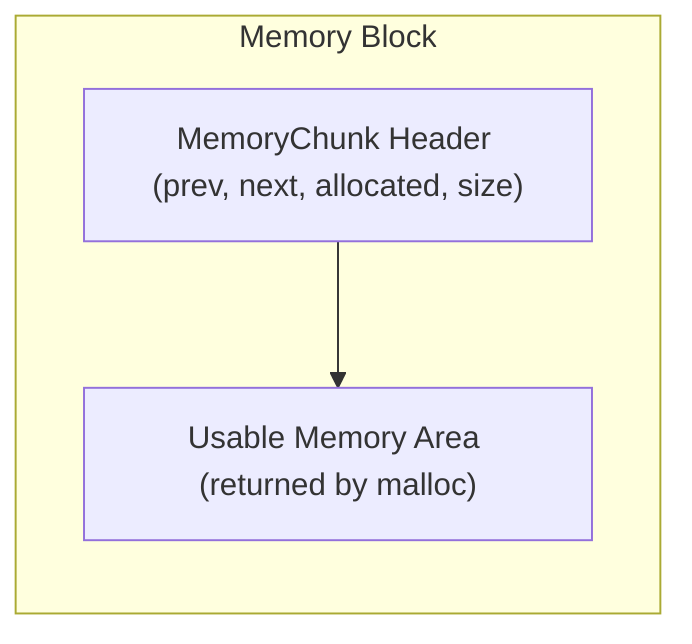
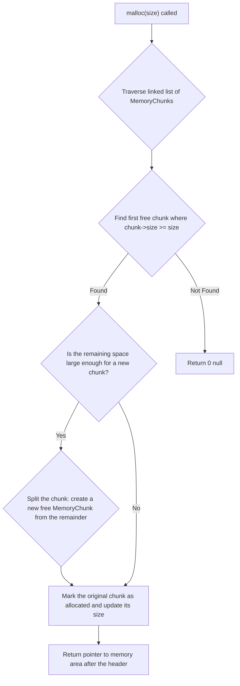
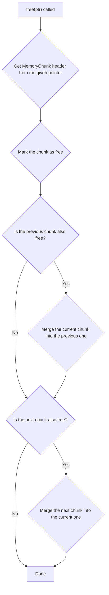

# Memory Management in uqaabOS

## Introduction

Dynamic memory management is one of the most critical functions of an operating system kernel. Unlike user-space applications, the kernel cannot rely on the OS to manage its memory (because it *is* the OS). It must manage its own memory space, known as the kernel heap, to handle unpredictable memory requirements for tasks like process creation, I/O buffering, and dynamic driver loading.

Kernel memory allocation comes with unique challenges:
- **Fragmentation:** Over time, the heap can become a patchwork of small, free blocks between allocated blocks. This "external fragmentation" can lead to allocation failures even when there is enough total free memory, simply because no single block is large enough.
- **No Safety Net:** A bug in the kernel's memory manager can be catastrophic, leading to data corruption or a complete system crash. There is no higher authority (like a virtual memory manager) to protect against invalid memory accesses.

uqaabOS implements a simple but effective heap-based memory manager. This manager uses a doubly linked list of memory "chunks" to keep track of allocated and free memory blocks. This approach, while basic, provides the fundamental `malloc` and `free` capabilities required by the kernel.

## Data Structures

The core of the memory manager is the `MemoryChunk` struct, which acts as a header for each block of memory.

**`memorymanagement.h`**
```cpp
struct MemoryChunk {
  MemoryChunk *next;
  MemoryChunk *prev;
  bool allocated;
  size_t size;
};
```

**Memory Layout:**

Each block of memory on the heap is composed of a header followed by the usable memory area that is returned to the caller.



-   `next` and `prev`: These pointers form a doubly linked list, allowing the manager to traverse the heap in both directions to find free blocks and perform coalescing.
-   `allocated`: A boolean flag that is `true` if the chunk is currently in use and `false` if it is free.
-   `size`: The size of the usable memory area in the chunk, *excluding* the size of the `MemoryChunk` header itself.

## Architecture and Allocation Strategy

uqaabOS uses a **first-fit** allocation strategy. When a request for memory is made, the manager scans the linked list of `MemoryChunk`s from the beginning and chooses the first free chunk that is large enough to satisfy the request. First-fit is simple and relatively fast, but it can sometimes lead to fragmentation if it repeatedly leaves small, unusable chunks at the beginning of the heap.

### `malloc` Flow and Splitting

If the first-fit algorithm finds a chunk that is larger than the requested size, it will split the chunk to avoid wasting memory. This is a crucial optimization.



### `free` Flow and Coalescing

When a block of memory is freed, the manager marks the corresponding chunk as not allocated. To combat fragmentation, the manager performs **coalescing**. It checks if the adjacent (previous or next) chunks in the linked list are also free. If they are, it merges them into a single, larger free chunk.



## Implementation Details

### `malloc`

**`memorymanagement.cpp`**
```cpp
void *MemoryManager::malloc(size_t size) {
  MemoryChunk *result = 0;

  // 1. First-Fit Search: Iterate through the list to find the first free chunk that is large enough.
  for (MemoryChunk *chunk = first; chunk != 0 && result == 0; chunk = chunk->next)
    if (chunk->size > size && !chunk->allocated)
      result = chunk;

  // 2. If no suitable chunk is found, return null.
  if (result == 0) return 0;

  // 3. Splitting: If the found chunk is large enough to be split...
  if (result->size >= size + sizeof(MemoryChunk) + 1) {
    // Create a new MemoryChunk header at the end of the requested block.
    MemoryChunk *temp =
        (MemoryChunk *)((size_t)result + sizeof(MemoryChunk) + size);
    temp->allocated = false;
    // The new chunk's size is the remainder.
    temp->size = result->size - size - sizeof(MemoryChunk);
    temp->prev = result;
    temp->next = result->next;
    if (temp->next != 0) temp->next->prev = temp;
    
    // Adjust the original chunk.
    result->size = size;
    result->next = temp;
  }

  // 4. Mark the chunk as allocated and return a pointer to the usable memory area.
  result->allocated = true;
  return (void *)(((size_t)result) + sizeof(MemoryChunk));
}
```

### `free`

**`memorymanagement.cpp`**
```cpp
void MemoryManager::free(void *ptr) {
  // 1. Get the MemoryChunk header from the user's pointer.
  MemoryChunk *chunk = (MemoryChunk *)((size_t)ptr - sizeof(MemoryChunk));
  
  // 2. Mark the chunk as free.
  chunk->allocated = false;

  // 3. Coalesce with previous chunk: If the previous chunk is also free...
  if (chunk->prev != 0 && !chunk->prev->allocated) {
    // Absorb the current chunk into the previous one.
    chunk->prev->next = chunk->next;
    chunk->prev->size += chunk->size + sizeof(MemoryChunk);
    if (chunk->next != 0) chunk->next->prev = chunk->prev;
    // The previous chunk is now the current chunk for the next step.
    chunk = chunk->prev;
  }

  // 4. Coalesce with next chunk: If the next chunk is also free...
  if (chunk->next != 0 && !chunk->next->allocated) {
    // Absorb the next chunk into the current one.
    chunk->size += chunk->next->size + sizeof(MemoryChunk);
    chunk->next = chunk->next->next;
    if (chunk->next != 0) chunk->next->prev = chunk;
  }
}
```

## Global `new` and `delete`

To make memory management easy and idiomatic in C++, the global `new` and `delete` operators are overloaded. This allows the kernel code to use the familiar `new` and `delete` keywords instead of calling `malloc` and `free` directly.

**`memorymanagement.cpp`**
```cpp
void *operator new(uqaabOS::memorymanagement::size_t size) {
  if (uqaabOS::memorymanagement::MemoryManager::active_memory_manager == 0)
    return 0;
  return uqaabOS::memorymanagement::MemoryManager::active_memory_manager->malloc(
      size);
}

void operator delete(void *ptr) {
  if (uqaabOS::memorymanagement::MemoryManager::active_memory_manager != 0)
    uqaabOS::memorymanagement::MemoryManager::active_memory_manager->free(ptr);
}
```
**Explanation:**
These overloaded operators simply redirect the calls to the `malloc` and `free` methods of the `active_memory_manager` instance. This is a clean way to integrate the custom memory manager with the C++ language features.

## Code Index

-   `src/include/memorymanagement/memorymanagement.h`: Defines the `MemoryManager` class and `MemoryChunk` struct.
-   `src/memorymanagement/memorymanagement.cpp`: Implements the `MemoryManager` class and overloads the global `new` and `delete` operators.
-   `src/kernel.cpp`: Initializes the `MemoryManager`.