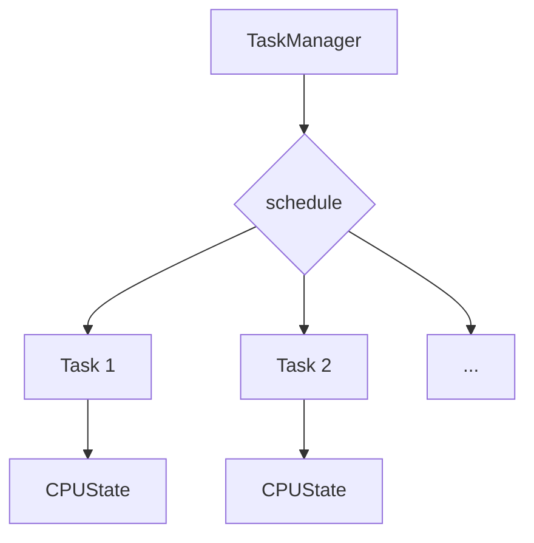
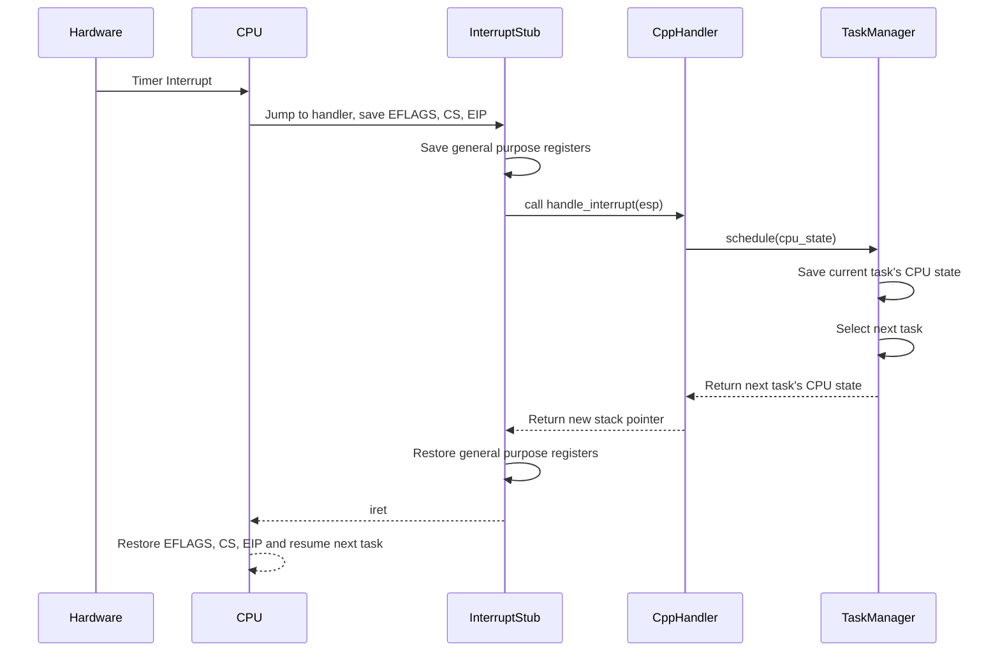

# Multitasking in uqaabOS

## Introduction

Multitasking in uqaabOS is a preemptive multitasking system that allows the operating system to run multiple tasks concurrently. This is achieved by rapidly switching between tasks, giving the illusion that they are running simultaneously. The current implementation uses a simple round-robin scheduler to ensure that each task gets a fair share of the CPU time.

## Architecture

The multitasking architecture in uqaabOS consists of three main components:

- **`Task`**: Represents a single task or process in the system. Each task has its own stack and CPU state.
- **`TaskManager`**: Manages all the tasks in the system. It is responsible for adding new tasks and scheduling them.
- **`CPUState`**: A structure that holds the state of the CPU for a particular task. This includes the values of all the general-purpose registers, the instruction pointer (`eip`), the stack pointer (`esp`), and the EFLAGS register.

### Mermaid Flowchart



## Scheduler and Context Switching

The scheduler is responsible for deciding which task to run next. uqaabOS uses a simple round-robin scheduler, where each task is given a small time slice of the CPU in a circular order. When a timer interrupt occurs, the scheduler is invoked to switch to the next task in the queue.

The context switching process is as follows:

1.  A timer interrupt occurs.
2.  The current CPU state is saved on the stack.
3.  The `schedule` function in the `TaskManager` is called.
4.  The `schedule` function saves the current task's `CPUState` and selects the next task to run.
5.  The `CPUState` of the next task is loaded.
6.  The interrupt handler returns, restoring the CPU state of the new task.

### Detailed Context Switching Flow

Here is a more detailed breakdown of the context switching process:

1.  **Hardware Interrupt:** The Programmable Interrupt Timer (PIT) sends an interrupt signal to the CPU.
2.  **CPU State Save (Hardware):** The CPU automatically pushes the current `EFLAGS`, `CS`, and `EIP` registers onto the stack of the currently running task.
3.  **Interrupt Handler Jumps:** The CPU jumps to the interrupt handler function defined in the Interrupt Descriptor Table (IDT). In this case, it's the timer interrupt handler in `interruptstub.asm`.
4.  **Save Registers (Software):** The assembly code in `interruptstub.asm` manually pushes all the general-purpose registers (`EAX`, `EBX`, `ECX`, `EDX`, `ESI`, `EDI`, `EBP`) onto the stack.
5.  **Call C++ Handler:** The assembly code then calls the `handle_interrupt` C++ function, passing the current stack pointer (`ESP`) as an argument.
6.  **Scheduler Invocation:** Inside `handle_interrupt`, the code identifies that a timer interrupt has occurred and calls the `TaskManager::schedule` function.
7.  **Save Current Task State:** The `schedule` function saves the current `ESP` (which now points to the saved `CPUState` on the stack) into the `cpu_state` member of the current `Task` object.
8.  **Select Next Task:** The scheduler selects the next task to run using a round-robin algorithm.
9.  **Load Next Task State:** The `schedule` function returns the `cpu_state` of the next task to be executed.
10. **Update Stack Pointer:** The `handle_interrupt` function returns the new `ESP` to the assembly code.
11. **Restore Registers (Software):** The assembly code in `interruptstub.asm` pops all the general-purpose registers from the new task's stack.
12. **Return from Interrupt:** The `iret` instruction is executed. This pops the `EIP`, `CS`, and `EFLAGS` from the new task's stack and jumps to the new `EIP`, effectively resuming the new task.

### Mermaid Flowchart: Context Switching



## Code Implementation

### `Task::Task`

The `Task` constructor initializes a new task. It allocates a 4KB stack for the task and sets up the initial `CPUState`.

```cpp
Task::Task(uqaabOS::include::GDT *gdt, void (*entry_point)()) {
  // Place CPUState at the top of the stack (highest address)
  cpu_state = (CPUState *)(stack + 4096 - sizeof(CPUState));

  // Initialize registers
  cpu_state->eax = 0;
  cpu_state->ebx = 0;
  cpu_state->ecx = 0;
  cpu_state->edx = 0;
  cpu_state->esi = 0;
  cpu_state->edi = 0;
  cpu_state->ebp = 0;

  // Set esp to the TOP of the stack (stack + 4096)
  cpu_state->esp = (uint32_t)(stack + 4096);

  // Set execution context
  cpu_state->eip = (uint32_t)entry_point;
  cpu_state->ss = gdt->data_segment_selector();
  cpu_state->cs = gdt->code_segment_selector();
  cpu_state->eflags = 0x202; // Enable interrupts
}
```

The `entry_point` is the function that the task will start executing. The `eflags` register is set to `0x202`, which enables interrupts.

### `TaskManager::add_task`

The `add_task` function adds a new task to the `TaskManager`.

```cpp
bool TaskManager::add_task(Task *task) {

  if (num_tasks >= 256)
    return false;

  tasks[num_tasks++] = task;

  return true;
}
```

The `TaskManager` can hold a maximum of 256 tasks.

### `TaskManager::schedule`

The `schedule` function is the heart of the scheduler. It is called by the timer interrupt handler to switch to the next task.

```cpp
CPUState *TaskManager::schedule(CPUState *cpu_state) {
  if (num_tasks <= 0) {
    return cpu_state;
  }

  // Save current task's state
  if (current_task >= 0) {
    tasks[current_task]->cpu_state = cpu_state;
  }

  // Select next task
  if (++current_task >= num_tasks) {
    current_task = 0;
  }

  // Return next task's state
  return tasks[current_task]->cpu_state;
}
```

The function first saves the `CPUState` of the current task and then selects the next task in a round-robin fashion.

### `interruptstub.asm`

The `interruptstub.asm` file contains the low-level interrupt handling code. When an interrupt occurs, the CPU pushes the current `eip`, `cs`, and `eflags` onto the stack. The interrupt handler then pushes the general-purpose registers onto the stack and calls the `handle_interrupt` C++ function.

```assembly
int_bottom:
    ; Save registers
    push ebp
    push edi
    push esi
    push edx
    push ecx
    push ebx
    push eax

    ; Call the C handler function
    push esp                            ; Push stack pointer as parameter
    push dword [interrupt_number]        ; Push interrupt number as parameter
    call handle_interrupt               ; Call C handler function
    mov esp, eax                        ; Update stack pointer from return value

    ; Restore registers
    pop eax
    pop ebx
    pop ecx
    pop edx
    pop esi
    pop edi
    pop ebp

    ; Clean up the stack (error code or dummy value)
    add esp, 4

    ; Return from interrupt
    iret
```

The `handle_interrupt` function (which is not shown here but is expected to be in `interrupts.cpp`) will call the `TaskManager::schedule` function when a timer interrupt occurs. The `schedule` function returns the `CPUState` of the next task, and the `handle_interrupt` function returns this new `CPUState` to the assembly code. The assembly code then restores the registers from the new `CPUState` and returns from the interrupt using `iret`. This effectively switches the CPU to the new task.

## Advanced Topics

### Latest Linux Scheduler: Completely Fair Scheduler (CFS)

Modern Linux kernels use the Completely Fair Scheduler (CFS) as their default scheduler. It is a significant departure from the simple round-robin scheduler used in uqaabOS.

#### Goals of CFS

The primary goal of CFS is to be "fair" to all tasks. This means that each task should receive a proportional amount of CPU time based on its priority. CFS aims to give each task an equal share of the CPU, as if there were a "perfectly multitasking" CPU.

#### How CFS Works

CFS works by maintaining a red-black tree of all runnable tasks. The tree is ordered by the amount of CPU time each task has consumed, which is stored in a value called `vruntime`. Tasks with a lower `vruntime` (meaning they have consumed less CPU time) are on the left side of the tree, and tasks with a higher `vruntime` are on the right.

When the scheduler needs to select a new task to run, it simply picks the leftmost node in the red-black tree, which is the task with the lowest `vruntime`. This ensures that tasks that have not run for a while get a chance to run.

When a task runs, its `vruntime` increases. If it runs for long enough, it will eventually be moved to the right side of the tree, and another task will be selected to run.

#### Differences from Round-Robin

| Feature | Round-Robin (uqaabOS) | Completely Fair Scheduler (Linux) |
| --- | --- | --- |
| **Data Structure** | Simple array or linked list | Red-black tree |
| **Scheduling Decision** | Picks the next task in the list | Picks the task with the lowest `vruntime` |
| **Fairness** | Each task gets the same time slice | Each task gets a proportional share of the CPU |
| **Priorities** | No concept of priorities | Priorities are handled by weighting the `vruntime` |
