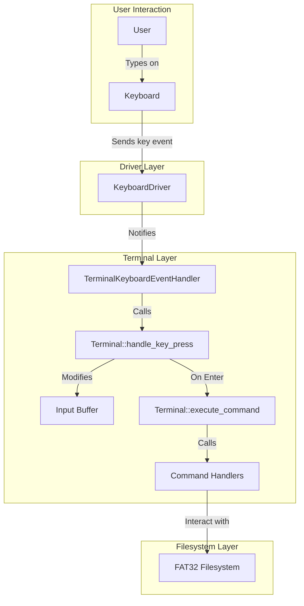
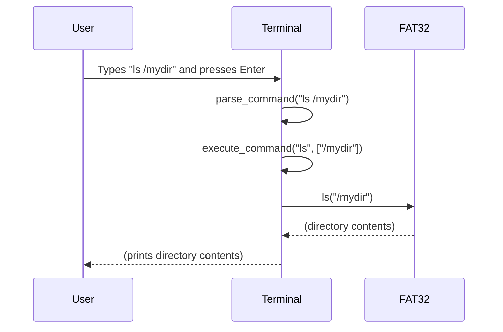

# Terminal Implementation in uqaabOS

## Introduction

The uqaabOS terminal provides a command-line interface for interacting with the operating system. It allows users to execute commands to manage files and directories, view file contents, and perform other basic tasks. The terminal is designed to be a simple yet functional interface for the underlying FAT32 filesystem.

## Terminal Command Use

The terminal supports the following commands:

-   **`ls [path]`**: Lists the contents of a directory. If no path is provided, it lists the contents of the root directory.
    -   Example: `ls /mydir`

-   **`mkdir <path>`**: Creates a new directory.
    -   Example: `mkdir /newdir`

-   **`touch <path>`**: Creates a new, empty file.
    -   Example: `touch /newdir/newfile.txt`

-   **`rm <path>`**: Deletes a file.
    -   Example: `rm /newdir/newfile.txt`

-   **`rmdir <path>`**: Deletes a directory. The directory must be empty.
    -   Example: `rmdir /newdir`

-   **`cat <path>`**: Displays the contents of a file.
    -   Example: `cat /newdir/newfile.txt`

-   **`write <file> <text>`**: Writes text to a file. If the file does not exist, it will be created. If it exists, its contents will be overwritten.
    -   Example: `write /newdir/newfile.txt "Hello, world!"`

-   **`echo <text>`**: Displays text on the screen.
    -   Example: `echo "This is a test"`

-   **`clear`**: Clears the terminal screen.

-   **`help`**: Displays a list of available commands.

## Architecture

The terminal is built around two main classes:

-   **`Terminal`**: This class is the core of the terminal. It handles user input, parses commands, and executes them. It maintains an input buffer to store the user's command before it is executed.

-   **`TerminalKeyboardEventHandler`**: This class acts as a bridge between the keyboard driver and the `Terminal` class. It receives key press events from the keyboard driver and forwards them to the `Terminal` for processing.

### Interaction Diagram

## Implementation Details

### Input Handling

Input handling is managed by the `Terminal::handle_key_press` function. This function is called by the `TerminalKeyboardEventHandler` every time a key is pressed.

-   **Regular Characters**: If a regular character is pressed, it is added to the `input_buffer` and echoed to the screen.
-   **Backspace**: If the backspace key is pressed, the last character is removed from the `input_buffer`, and the cursor is moved back one space on the screen.
-   **Enter**: If the Enter key is pressed, the command in the `input_buffer` is executed.

### Command Parsing and Execution

When the Enter key is pressed, `Terminal::execute_command` is called. This function first calls `Terminal::parse_command` to split the input buffer into a command and its arguments. The command is then compared against a list of known commands, and the corresponding handler function is called.

### Command Execution Sequence

### Command Handlers

Each command has a dedicated handler function (e.g., `handle_ls`, `handle_mkdir`). These functions are responsible for validating the arguments and calling the appropriate functions in the `FAT32` class to perform the requested operation.

## Code Index

The following files are relevant to the terminal implementation in uqaabOS:

-   `src/include/terminal/terminal.h`: Defines the `Terminal` class.
-   `src/include/terminal/terminal_keyboard.h`: Defines the `TerminalKeyboardEventHandler` class.
-   `src/terminal/terminal.cpp`: Implements the core logic of the `Terminal` class.
-   `src/terminal/terminal_keyboard.cpp`: Implements the `TerminalKeyboardEventHandler` class.
